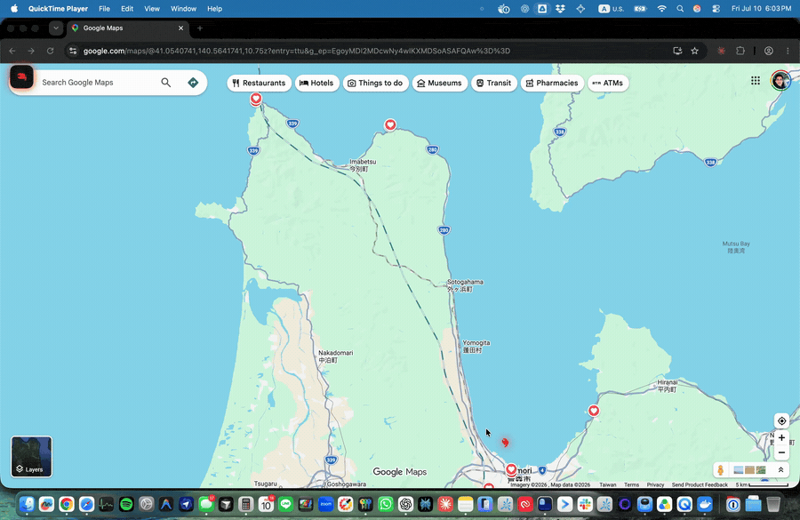
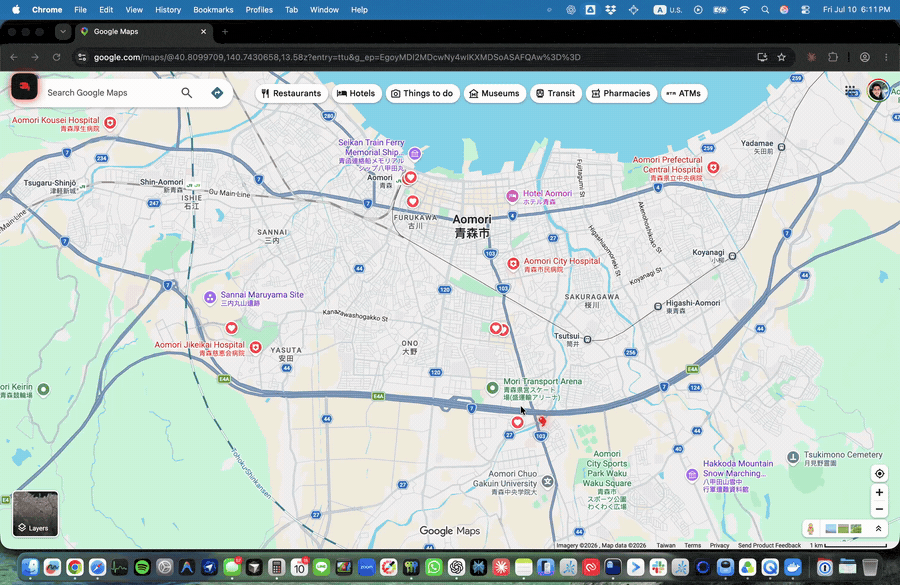

<p align="center">
  
</p>

<h1 align="center">Clawdy</h1>

Clawdy unleashes Claude Code, Codex, and other CLI AI harnesses **from the terminal onto your whole desktop** — turning the coding agent you already use into a cursor assistant that can see what you see and talk with you out loud.

It's not a reimplementation: Clawdy **builds on top of and shells out to** the `claude` or `codex` CLI already installed and signed in on your machine, so it can do everything those harnesses can — billed to *your* existing subscription, with no model API keys, no proxy, and nothing sensitive in the app. And because it drives the same underlying session, you can **hand a conversation off and resume it right back in the CLI** whenever you want the terminal again.

Voice is local by default: speech-to-text uses Apple's on-device Speech framework, and text-to-speech uses the built-in `AVSpeechSynthesizer` — no API key, nothing leaves your Mac except the CLI's own model call. Optionally, bring your own **ElevenLabs API key** for higher-quality voice and audio-synced cursor pointing; if it isn't set (or a request fails), Clawdy falls back to Apple's built-in TTS automatically.

<p align="center">
  <a href="https://github.com/tomkit/getclawdy/releases/latest/download/Clawdy.dmg">
    
  </a>
</p>

**Point at your screen and talk** — Clawdy answers out loud and the claw flies to what it means.



**Ask a big question** — Clawdy researches the web and builds you a page.



**Explore an area** — circle a spot and Clawdy walks you through what's around.


## Download

The easiest way to run Clawdy is the signed, notarized build:

**[⬇ Download Clawdy.dmg](https://github.com/tomkit/getclawdy/releases/latest/download/Clawdy.dmg)** — universal (Intel & Apple Silicon), signed and notarized.

1. Open the DMG and drag **Clawdy** into **Applications**.
2. Launch Clawdy, then grant **Screen Recording**, **Accessibility**, and **Microphone** when prompted (and relaunch).
3. Make sure the `claude` or `codex` CLI is installed and signed in (see [Requirements](#requirements)).

The build is a single universal binary (Intel & Apple Silicon), signed with a Developer ID certificate and notarized by Apple, so it opens without Gatekeeper warnings. Verify your download against the `SHA256SUMS` attached to each release:

```bash
shasum -a 256 -c SHA256SUMS
```

See the [changelog](CHANGELOG.md) for what changed in each version.

## How it works

1. Hold **Control + Option** to talk (push-to-talk). Audio is transcribed on-device with Apple Speech.
2. On release, Clawdy captures a screenshot of each connected display (downscaled to ≤800px, one JPEG per screen, only when you press the hotkey — never continuously).
3. The transcript + screenshots + a coaching system prompt are handed to your selected engine:
   - **Claude Code** → the `claude` CLI in headless print mode.
   - **Codex** → the `codex` CLI in non-interactive `exec` mode.
4. The model's reply is streamed back, spoken aloud, and — if it emitted `[POINT:x,y:label:screenN]` tags — the claw cursor walks to each on-screen element it names and labels it. With an ElevenLabs key the moves are timed to the audio and arrive a beat before each place is spoken; otherwise the claw visits them in order.

## Requirements

Everything you need to **run** the downloaded app:

- macOS 14.2 (Sonoma) or later — the download is a universal binary (Intel & Apple Silicon)
- **At least one coding CLI, installed and signed in:**
  - [Claude Code](https://docs.anthropic.com/en/docs/claude-code) — `npm install -g @anthropic-ai/claude-code`, then `claude` (sign in once)
  - [Codex](https://github.com/openai/codex) — `npm install -g @openai/codex`, then `codex login`
- **Optional — [ElevenLabs](https://elevenlabs.io) API key** for higher-quality voice and audio-synced cursor pointing. Add it in the menu-bar panel (stored in the macOS Keychain); without it, Clawdy automatically uses Apple's built-in on-device text-to-speech — no key required, nothing leaves your Mac.

That's it. No required API keys, no Cloudflare account, no Node Worker — and **no Xcode**: Xcode is only needed to build from source, not to run the download (see [Build & run](#build--run)). Clawdy auto-detects which CLIs are installed and lets you pick between them in the menu-bar panel.

## Build & run

Building from source (instead of using the [download](#download)) requires **Xcode 16+**.

```bash
open Clawdy.xcodeproj
```

In Xcode:
1. Select the `Clawdy` scheme.
2. Set your signing team under Signing & Capabilities.
3. Hit **Cmd + R**.

The app appears in your menu bar (no dock icon). Click the icon, grant the permissions it asks for, pick your engine, and start talking.

### Permissions

- **Microphone** — push-to-talk voice capture
- **Speech Recognition** — on-device transcription (Apple Speech)
- **Accessibility** — the global Control + Option shortcut (listen-only CGEvent tap)
- **Screen Recording** / **Screen Content** — screenshots when you press the hotkey

The app is intentionally **not sandboxed** (`com.apple.security.app-sandbox = false`) because it shells out to your CLI binaries and captures the screen.

## License

Clawdy's own source is licensed under the **MIT License** (see `LICENSE` and `NOTICE`). Third-party components bundled in the app are listed in `THIRD-PARTY-LICENSES.md`.
