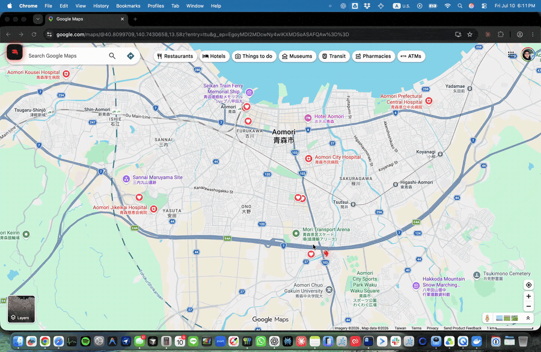

<p align="center">
  
</p>

<h1 align="center">Clawdy</h1>

<p align="center"><strong>Hold a key, ask a question, and a little claw points at the answer on your screen.</strong></p>

Clawdy is a free, open-source helper that lives in your Mac's menu bar. Hold **Control + Option**, say what you need, and let go. Clawdy looks at your screen, answers out loud, and flies a little red claw to whatever it's talking about, in any app.

Clawdy has no AI of its own. It runs on the **Claude Code** or **Codex** you already have installed, so there is nothing new to sign up for and no separate bill. Your voice never leaves your Mac.

<p align="center">
  <a href="https://github.com/tomkit/getclawdy/releases/latest/download/Clawdy.dmg">
    
  </a>
</p>

## What it looks like

**Point at your screen and talk.** Clawdy answers out loud and the claw flies to what it means.


**Ask a big question.** Clawdy researches the web and builds you a page.



**Circle something.** Draw on the screen while you talk and Clawdy sees the circle too.


## Things you can ask

- "Which of these settings should I turn on?"
- "What does this error mean and what do I click?"
- "Walk me through filling out this form."
- "Explain this chart to me."
- "What's wrong with this spreadsheet formula?"
- "Read this email and tell me what they actually want."
- "Where's the export button in this app?"
- "Compare these three products and put together a page for me."

Any window, any app, both monitors. If you can see it, Clawdy can see it.

## Get started

1. **[Download Clawdy.dmg](https://github.com/tomkit/getclawdy/releases/latest/download/Clawdy.dmg)**, open it, and drag Clawdy into **Applications**.
2. Launch Clawdy and allow **Microphone**, **Screen Recording**, and **Accessibility** when asked (then relaunch).
3. Make sure one of these is installed and signed in. If you already use it, you're done:
   - [Claude Code](https://docs.anthropic.com/en/docs/claude-code): `npm install -g @anthropic-ai/claude-code`, then run `claude` once to sign in.
   - [Codex](https://github.com/openai/codex): `npm install -g @openai/codex`, then `codex login`.
4. Click the claw in your menu bar, then hold **Control + Option** and talk.

Needs macOS 14.2 (Sonoma) or later. Works on Intel and Apple Silicon.

Optional: add an [ElevenLabs](https://elevenlabs.io) key in the menu-bar panel for a nicer voice. Without it, Clawdy uses the voice built into macOS.

## For the technically curious

**It's your CLI, your tokens.** Clawdy shells out to the `claude` or `codex` binary on your machine. Every answer is billed to the subscription that CLI is signed into. There are no model API keys, no proxy, and nothing sensitive in the app. Because it drives the same underlying session, you can hand a conversation off and **resume it in the terminal** (`claude --resume`, `codex resume`) whenever you want.

**Your own setup comes along.** By default Clawdy runs `claude` without `--safe-mode`, so your CLAUDE.md, skills, plugins, hooks, and MCP servers all load, the same as in your terminal. Turn "Use my Claude Code setup" off in the panel to isolate it.

**What happens on each press:**

1. Hold Control + Option. Audio is transcribed on-device with Apple's Speech framework.
2. On release, Clawdy captures one downscaled JPEG (≤800px) per connected display. Only when you press the key, never continuously.
3. Transcript, screenshots, and a coaching system prompt go to your engine: `claude -p` in stream-json print mode (kept warm for the app's lifetime), or `codex exec`.
4. The reply streams back and is spoken sentence by sentence with `AVSpeechSynthesizer`. `[POINT:x,y:label:screenN]` tags in the reply drive the claw to each element. With an ElevenLabs key, the claw's moves are synced to the audio and arrive a beat before each thing is named.

**Research mode.** For big "look this up and build me something" asks, Clawdy runs a separate `claude -p` (or `codex exec`) session with web search and a narrow write allowlist, produces a single self-contained `report.html`, and opens it in an embedded window. Runs are indexed in a History window with follow-up chat.

**Permissions.** Microphone (push-to-talk), Speech Recognition (on-device transcription), Accessibility (the global shortcut, via a listen-only CGEvent tap), Screen Recording (screenshots on hotkey). The app is deliberately not sandboxed because it launches your CLI binaries and captures the screen.

**Verify your download** against the `SHA256SUMS` attached to each release: `shasum -a 256 -c SHA256SUMS`. The DMG is a universal binary, signed with a Developer ID and notarized by Apple. See the [changelog](CHANGELOG.md) for what changed in each version.

## Build from source

Requires Xcode 16+.

```bash
open Clawdy.xcodeproj
```

Select the `Clawdy` scheme, set your signing team under Signing & Capabilities, and hit **Cmd + R**. The app appears in your menu bar (no dock icon).

## Credits and license

Clawdy is an open-source fork of [heyclicky](https://heyclicky.com), rebuilt to run on the coding CLI you already have instead of a hosted backend. Clawdy's own source is under the **MIT License** (`LICENSE`); the upstream MIT notice is retained in `NOTICE`. Bundled third-party components are listed in `THIRD-PARTY-LICENSES.md`.
