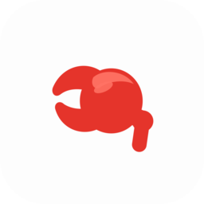
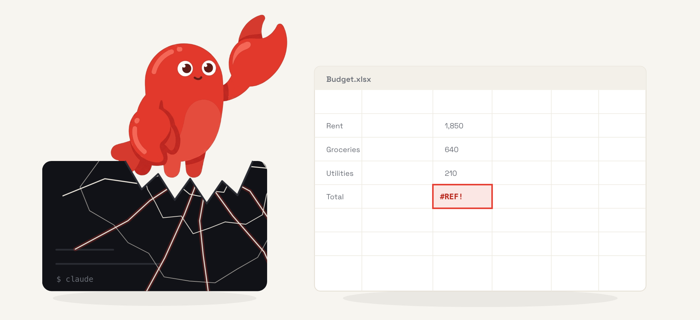
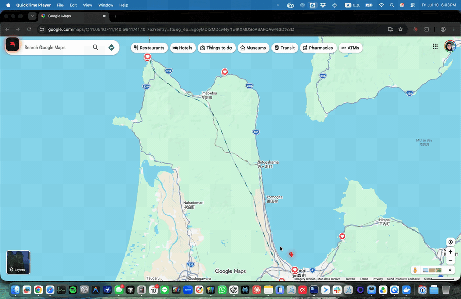

<p align="center">
  
</p>

<h1 align="center">Your AI, out of its shell.</h1>

<p align="center">Talk to your Mac. Clawdy sees your screen, talks back, and points at things.</p>

<p align="center">
  <a href="https://getclawdy.com">getclawdy.com</a> ·
  <a href="https://github.com/tomkit/getclawdy/releases/latest/download/Clawdy.dmg">Download for Mac</a> ·
  <a href="CHANGELOG.md">Changelog</a>
</p>

<p align="center">
  
</p>

Hold Control + Option and say what you need. Clawdy looks at your screen, answers you out loud, and the claw flies to whatever it's talking about. It's a conversation: ask a follow-up, and it remembers what you were just talking about.

Clawdy runs on your own local Claude Code or Codex, using your subscription tokens. No account, nothing extra to pay for, and your voice stays on your Mac.

- You talk. Hold the keys and speak. No typing.
- It sees what you see. Every window, every monitor.
- It talks back, out loud, while you keep working.
- It points. The claw cursor lands on the exact spot.

<p align="center">
  <a href="https://github.com/tomkit/getclawdy/releases/latest/download/Clawdy.dmg">
    
  </a>
</p>

## Ask questions like:

- "What did I just break?"
- "Which of these settings do I actually need on?"
- "I have no idea what this box wants."
- "What do they actually want from me in this email?"
- "Find me three laptops under $900 and put it on one page."

Say any of these out loud. Clawdy answers out loud and the claw points things out. Bigger tasks get handed to your local harness, so everything you've set up there (subagents, prompts, plugins, skills) comes along.

## Example: planning a road trip

Point at your screen and talk. Clawdy answers out loud and the claw flies to what it means.



## Get started

1. [Download Clawdy.dmg](https://github.com/tomkit/getclawdy/releases/latest/download/Clawdy.dmg), open it, drag Clawdy into Applications.
2. Launch it. Allow Microphone, Screen Recording, and Accessibility when asked, then relaunch.
3. Have Claude Code or Codex installed and signed in. If you already use one, skip this.
   - Claude Code: `npm install -g @anthropic-ai/claude-code`, then run `claude` once to sign in.
   - Codex: `npm install -g @openai/codex`, then `codex login`.
4. Hold Control + Option and talk.

macOS 14.2 or later, Intel or Apple Silicon.

If you want a nicer voice, put an [ElevenLabs](https://elevenlabs.io) key in the menu bar panel. Otherwise it uses the macOS voice.

## Use your own CLI harness

Clawdy shells out to the `claude` or `codex` binary on your machine. Whatever you ask gets billed to the subscription that CLI is signed into. No API keys, no proxy, no server of ours in the middle.

Because it's your real CLI, your setup comes with it: CLAUDE.md, skills, plugins, hooks, MCP servers. And every conversation is a real session. Pick one up in the terminal with `claude --resume <id>` (or `codex resume`), or click "Resume in Terminal" in the History window.

## Skills and routing

Quick questions get a quick spoken answer. Bigger ones, like "research this and build me a page" or "plan me three days in Kyoto," get handed to a skill: your existing Claude Code skills, or Clawdy-specific ones. A separate agent goes off, does the work, and comes back with a page or a spoken result.

How Clawdy decides: every question goes to the voice agent first. If it can answer from your screen or from what it knows, it answers. If the ask needs the web, several steps, or a finished page, or it matches one of the skills it has, it replies with one line like

```
[RESEARCH] compare the three best standing desks under $1000 and build a page
```

and Clawdy starts that skill in its own process. "Where do I click?" questions are never routed; those always get a spoken answer and the claw.

**Your Claude Code skills already work.** Anything in `~/.claude/skills` (or `~/.codex/skills`) can be asked for by voice. Clawdy runs it in a `claude` session and reads the result back. Nothing to set up.

**Clawdy skills** live in `~/.clawdy/skills`. Same `SKILL.md` format, written for voice in and a page or spoken answer out. Two come installed:

| Skill | Say | You get |
|---|---|---|
| `research` | "Find the best noise-cancelling headphones and build me a page." | Web research, one clarifying question if needed, and a page. Keep talking to change it. |
| `trip-planner` | "Plan me three days in Kyoto." | A day-by-day itinerary page with neighborhoods and places to eat. |

Edit `research/SKILL.md` if you want research to behave differently. Changes take effect on your next question.

**Adding one.** New folder in `~/.clawdy/skills`, one `SKILL.md`. The description tells the router when to use it. The body tells the agent what to do.

```markdown
---
name: recipe-finder
description: finds a recipe for what the user has on hand and builds a page with it. use for "what can i make with X". example, user says "what can i make with eggs and spinach": [RECIPE_FINDER] find a recipe using eggs and spinach and build a page.
allowed-tools: WebSearch, WebFetch, Write
clawdy-deliverable: html
---

Find a good recipe for: {{task}}. Search the web, pick one, and write ONE self-contained HTML page to {{outputPath}} with ingredients, steps, and how long it takes.
```

Now say "what can I make with eggs and spinach."

The bracket tag comes from the name (`recipe-finder` → `[RECIPE_FINDER]`). `clawdy-deliverable: none` makes a skill speak its answer instead of opening a page. `research/SKILL.md` shows how to control each phase separately, and `~/.clawdy/skills/README.md` lists every option.

## Build from source

You need macOS 14.2+ and Xcode 16+. Point the command line tools at it: `sudo xcode-select -s /Applications/Xcode.app`.

```bash
git clone https://github.com/tomkit/getclawdy.git
cd getclawdy
open Clawdy.xcodeproj
```

In Xcode, pick the Clawdy scheme and the My Mac destination, set your team under Signing & Capabilities (a personal Apple ID is fine), and press Cmd + R. The app shows up in the menu bar; there's no dock icon or window. First launch asks for Microphone, Speech Recognition, Accessibility, and Screen Recording. Grant them and relaunch. They're tied to the code signature, so a build signed differently will ask again.

Tests: Cmd + U, or

```bash
xcodebuild test -project Clawdy.xcodeproj -scheme Clawdy -destination 'platform=macOS' -only-testing:ClawdyTests CODE_SIGNING_ALLOWED=NO
```

Build from Xcode for day-to-day work. Terminal `xcodebuild` runs can reset the permissions above.

To check a downloaded release: each one ships a `SHA256SUMS`. The DMG is signed with a Developer ID and notarized by Apple.

```bash
shasum -a 256 -c SHA256SUMS
```

## Credits and license

Clawdy is a fork of [heyclicky](https://heyclicky.com), rebuilt to run on the coding CLI you already have instead of a hosted backend. Clawdy's code is MIT (`LICENSE`); the upstream notice is in `NOTICE`. Bundled third-party components are listed in `THIRD-PARTY-LICENSES.md`.
